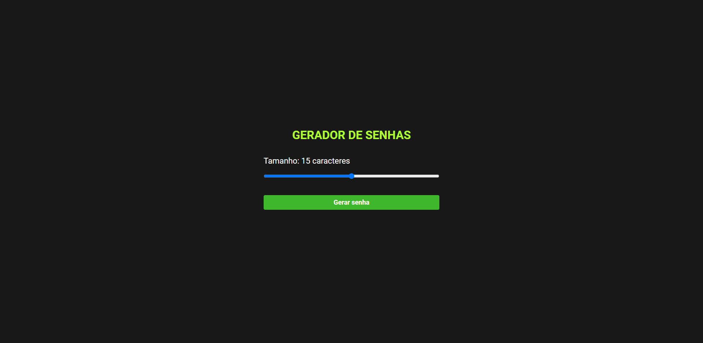
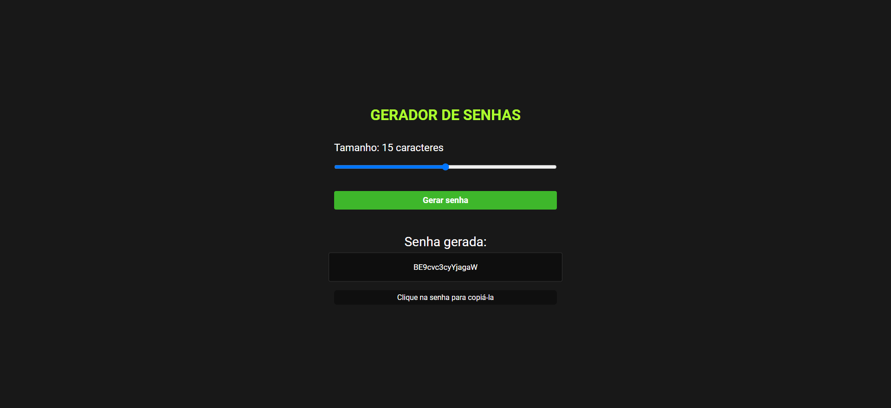

<h1 align="center"> Gerador de Senhas </h1>

Gerador de Senhas é um projeto desenvolvido com HTML, CSS e JavaScript, com base nos ensinamentos do [vídeo - Criando projeto completo com HTML, CSS e JavaScript](https://youtu.be/i6t2jaRxos4) do canal [@Sujeitoprogramador](https://www.youtube.com/@Sujeitoprogramador) no Youtube. 

 

  <a href="#-tecnologias">🚀 Tecnologias</a>&nbsp;&nbsp;&nbsp;|&nbsp;&nbsp;&nbsp;
  <a href="#-projeto">💻 Projeto</a>&nbsp;&nbsp;&nbsp;|&nbsp;&nbsp;&nbsp;
  <a href="#-layout">🔖 Layout</a>&nbsp;&nbsp;&nbsp;|&nbsp;&nbsp;&nbsp;
  <a href="#memo-licença">:memo: Licença</a>

 

  
  

 

## 🚀 Tecnologias

Esse projeto foi desenvolvido com as seguintes tecnologias:

 

## 💻 Projeto

O projeto é um site que permite gerar senhas aleatórias, com um tamanho que pode variar de 5 (cinco) a 25 (vinte e cinco) caracteres. Também foi adicionada a função para copiar a senha gerada apenas com um clique.

 

## 🔖 Layout

Você pode navegar pelo projeto através [DESSE LINK](https://thiagomonts.github.io/password-generator/).

 

## :memo: Licença

Esse projeto está sob a licença MIT.

 

---

Desenvolvido por [Thiago Honorato](https://www.linkedin.com/in/honoratothiago/)
